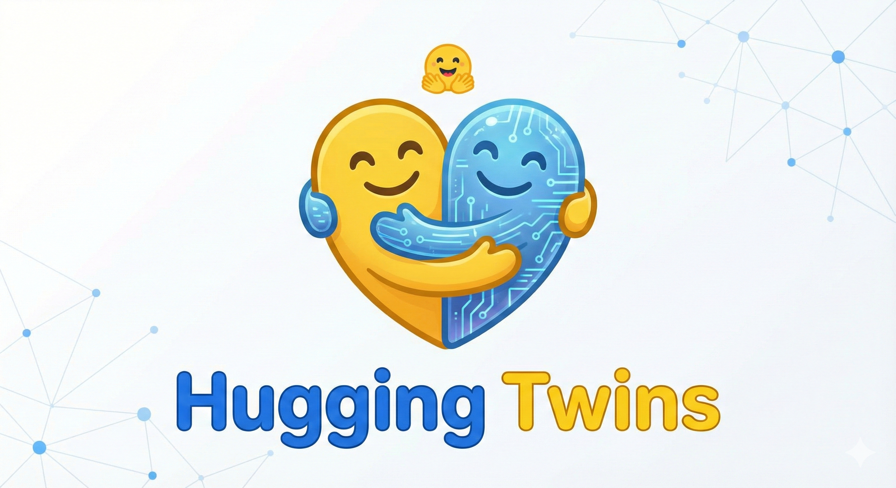
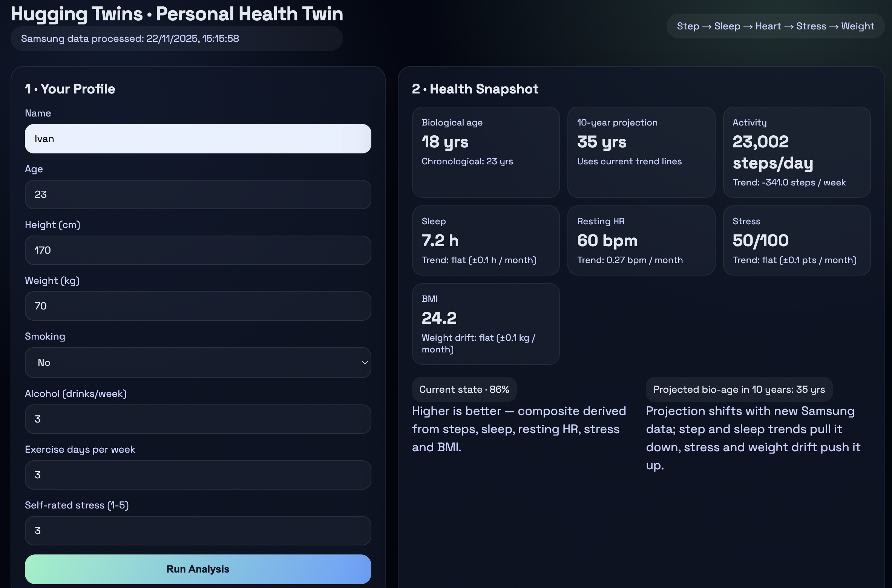

# Hugging Twins

Digital Twin Monitoring for Connected Devices

## Health Twin Dashboard

This repo now ships with a lightweight dashboard that blends Samsung Health exports with a short questionnaire to estimate biological age, show current health state, analyze trends, and project a 10-year outlook.

### Quick start

1. Create a local environement:

   `python -m venv venv`

2. Activate the local env (contains numpy/pandas):

   `source venv/bin/activate`

3. Install the requirements:

   `pip install -r requirements.txt`

4. Place the Samsung health data into `data/` folder

5. Generate the summary JSON from the Samsung exports in `data/`:

   `python health_dashboard.py`

6.  Serve the repo (so the dashboard can fetch the JSON):

   `python -m http.server 8000`

7. Open the dashboard at `http://localhost:8000/dashboard.html`

### Dashboard flow

1. Fill the profile card (age, height, weight if you want to override the scale reading, smoking, alcohol, activity, stress).
2. Click **Run Analysis** to compute biological age from the questionnaire + Samsung data.
3. Review current state, trends (steps, sleep, resting HR, stress, weight), and the 10-year projection.

The data pipeline is implemented in `health_dashboard.py`; the UI lives in `dashboard.html` and expects the generated `data/health_summary.json`.
